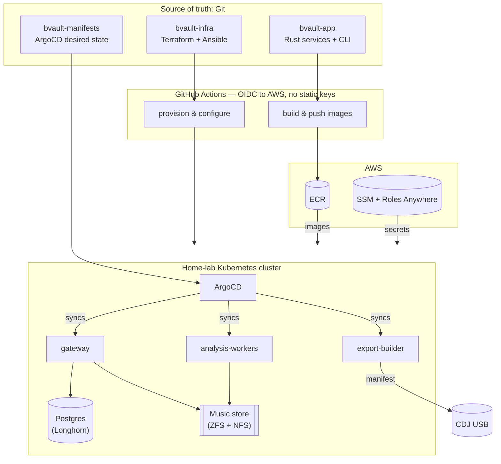

# BeatVault

**A self-hosted DJ music platform that ingests, analyzes, stores and exports playlist-ready USBs directly to Pioneer CDJs — completely free of proprietary software.**

https://github.com/user-attachments/assets/62beafc7-2bfa-4036-99af-3062948a2773

BeatVault does two things that normally require Pioneer's proprietary rekordbox software and a
lot of manual file-shuffling. It gives you one central library you can fill from YouTube,
local files or Google Drive, and it writes USB drives that plug straight into any club's CDJ —
beat grids, waveforms, cue points and all. The catch that makes it interesting: the CDJ export
format is proprietary and undocumented, so BeatVault implements it from scratch, byte for byte.

The whole thing runs on infrastructure that is itself code. Two bare-metal machines become a
highly-available Kubernetes cluster through Terraform and Ansible, and every workload is
reconciled from git by ArgoCD. Destroy it and rebuild it from an empty disk by running a few
pipelines.

---

## The three repositories

BeatVault is composed of three submodules, each a project in its own right.

| Repository | What it is |
|------------|-----------|
| **[bvault-app](https://github.com/xilver1/bvault-app)** | The application — a Rust workspace (11 crates + 4 services) that ingests, analyses and exports music, plus the `bvault` CLI. Home of the from-scratch rekordbox PDB/ANLZ implementation. |
| **[bvault-infra](https://github.com/xilver1/bvault-infra)** | Infrastructure-as-Code — Terraform + Ansible that turn bare metal into an HA kubeadm cluster, driven from GitHub Actions with OIDC and zero static credentials. |
| **[bvault-manifests](https://github.com/xilver1/bvault-manifests)** | The GitOps desired state — ArgoCD app-of-apps, External Secrets, and every workload manifest. |

Plus `bvault-android-connect/`, a small companion app that syncs YouTube auth cookies from a
phone so mobile ingestion works.

---

## How it fits together



A code change flows one way: commit to `bvault-app` and CI builds an immutable, SHA-tagged
image into ECR; bump that tag in `bvault-manifests` and ArgoCD rolls it out. Infrastructure
changes go through `bvault-infra`, and the tailnet's own access policy is managed as code too.

---

## Highlights

**Application**
- Byte-exact **rekordbox export format** implementation — `export.pdb` (DeviceSQL, little-endian)
  and `ANLZ` files (big-endian, tagged sections), written with `binrw`.
- Pure-Rust audio analysis — `symphonia` decoding, `rustfft` waveforms, BPM and beat-grid detection.
- **Resumable, diff-based USB export**: only new tracks are transferred to a stick that already
  holds most of a playlist.
- Sound security defaults: Argon2id, SHA-256-hashed session tokens, AES-256-GCM cookies, and
  multi-tenancy enforced at the data layer.
- Cross-compiles to Android/Termux.

**Platform**
- Unattended bare-metal installs (Proxmox `answer.toml`, Debian preseed).
- HA Kubernetes via `kubeadm`, keepalived VIP + HAProxy, Calico VXLAN on a dedicated pod CIDR.
- **Zero static cloud credentials** — GitHub OIDC federation with purpose-separated IAM roles.
- **Ephemeral CI on the tailnet**: runners join Tailscale per-job with least-privilege,
  port-scoped grants; the ACL itself is GitOps-managed.
- Secrets via SSM + IAM Roles Anywhere + External Secrets Operator — nothing sensitive in git.
- Distributed storage (Longhorn), bulk media on ZFS/NFS with sanoid snapshots, and an
  observability box running Prometheus, Grafana and Loki.

---

## Documentation

- **[docs/](docs)** — architecture, workflows, and technical deep-dives.
  - [Architecture & workflow](docs/user_architecture.md) — how ingestion and export work, with diagrams.
  - [Crates](docs/technical_crates.md) · [Services](docs/technical_services.md) — internals.
- Each submodule has its own README covering that layer in depth.

---

## Repository layout

```
BeatVault/
├── bvault-app/            # Rust application + CLI            (submodule)
├── bvault-infra/          # Terraform + Ansible IaC           (submodule)
├── bvault-manifests/      # ArgoCD GitOps manifests           (submodule)
├── bvault-android-connect/# Android cookie-sync companion
├── build_android.ps1      # cross-compile the CLI for Android
└── docs/                  # architecture & technical docs
```

Clone with submodules:

```bash
git clone --recurse-submodules https://github.com/xilver1/BeatVault.git
```