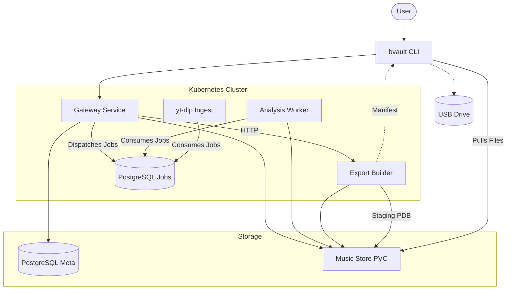
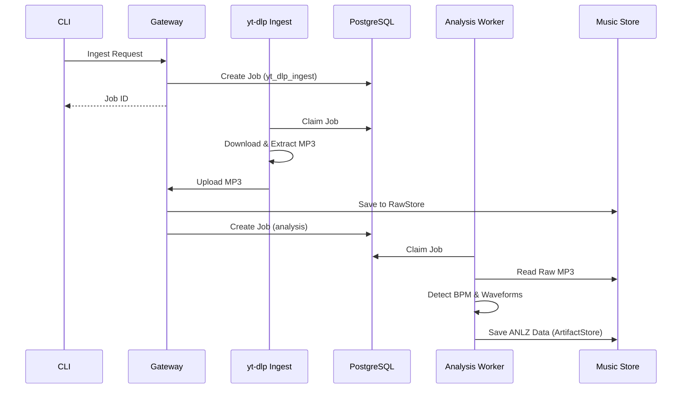
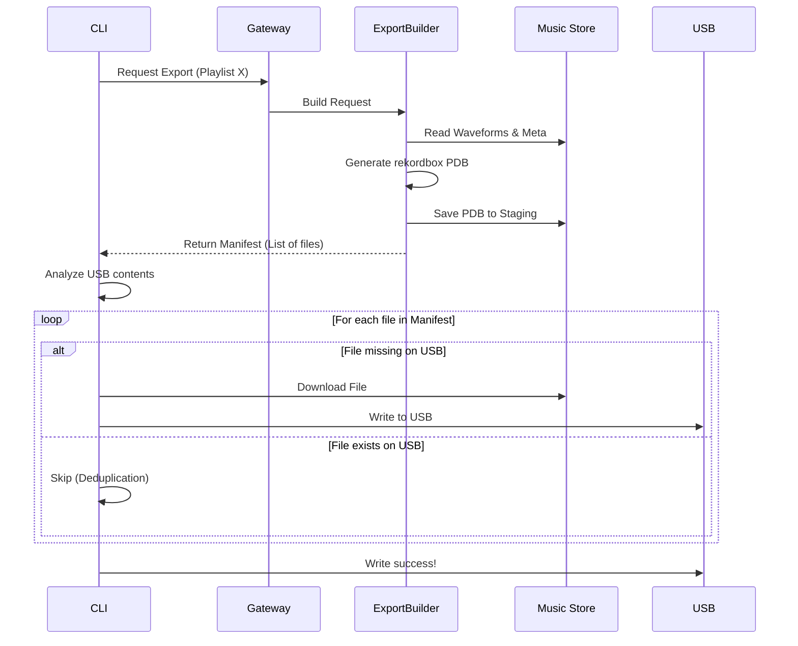

# BeatVault Architecture & Workflow

BeatVault is designed to let you self-host your music collection and export it to a Pioneer CDJ-compatible USB without needing proprietary desktop software. Here's a high-level overview of how the system operates.

## System Architecture

The BeatVault architecture consists of several interconnected components, separating the heavy lifting of audio analysis from the fast, responsive API Gateway.

### Components
1. **bvault CLI:** Your main tool for interacting with BeatVault. You can search, ingest, build playlists, and export to USB directly from your terminal.
2. **Gateway:** The brain of the operation. It handles your logins, saves your playlists, and orchestrates tasks.
3. **PostgreSQL:** The database storing your user accounts, track metadata, and the queue of pending background jobs.
4. **Music Store (PVC):** The persistent volume on your server where all your raw MP3/FLAC files and analyzed waveform data are saved.
5. **Workers:** 
    - **Analysis Worker:** Constantly looks for new music, analyzes the BPM, beat grid, and waveforms, and saves that data to the Music Store.
    - **yt-dlp Ingest:** Safely downloads tracks from external services (like YouTube) and passes them to the Gateway.
6. **Export Builder:** When you request a USB export, this service quickly generates the proprietary Pioneer database (`.pdb`) and tells your CLI exactly which files to copy to your USB.

## The Ingestion Workflow

When you ingest a new track (e.g., via `bvault ingest youtube <url>`), it goes through several steps to ensure it's ready for a CDJ.

## The Export Workflow

BeatVault's export process is unique. Instead of generating the entire USB on the server and forcing you to download a massive ZIP file, BeatVault acts as a synchronization engine.

**Why this is great:** If you add 5 new songs to a 1,000-song playlist, the CLI will only download and transfer those 5 new songs to your USB, making exports lightning fast!
